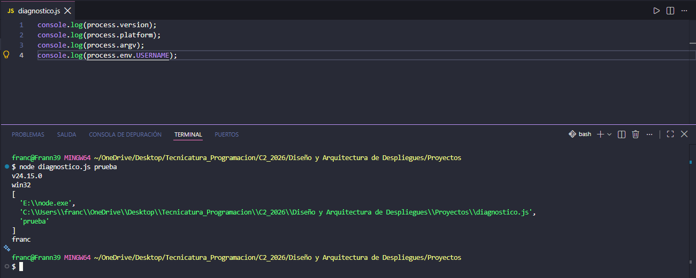
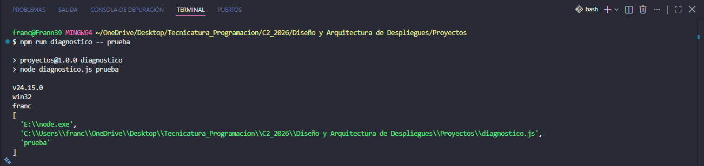

# Proyecto Diagnostico

## ¿Qué hice en este proyecto?

- Utilicé los `console.log()` con el objeto nativo de Node `process` y la notación de punto para acceder a los datos pedidos.

---

- Luego utilicé el gestor de paquetes npm para estandarizar y automatizar los comandos del proyecto.

- Generé un archivo `package.json` utilizando el comando `npm init -y`.

- Después de eso configuré el script dentro del `package.json` por `"diagnostico": "node diagnostico.js"` que ejecutándolo en la git bash me mostraría lo siguiente.

> Observé que tuve que utilizar los dos guiones (--) antes de la palabra "prueba", que llega a `process.argv`.
